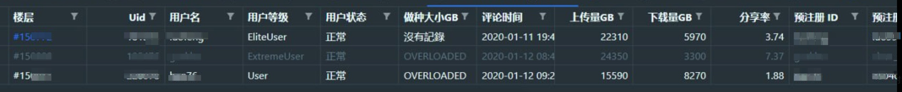
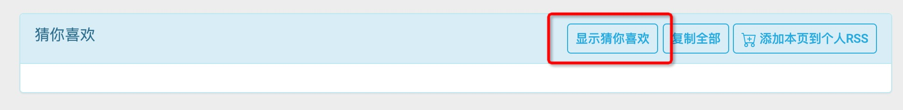

# nexusphp 油猴脚本

## 通用评论过滤脚本

* https://greasyfork.org/zh-CN/scripts/466707-nexusphp-%E5%B8%96%E5%AD%90%E8%AF%84%E8%AE%BA%E6%94%B6%E9%9B%86

> 按预定格式过滤评论, 过滤被 ban 用户, 清洗出发药需要的一些数据  

* 目前最后的数据包括: `楼层,uid,用户名,用户等级,用户状态,做种大小GB,评论时间,上传量GB,下载量GB,分享率,预注册 ID,预注册邮箱,用户详情页`
* 如果遇到乱码问题，请使用 Google文档打开 或者 修改编码为 `UTF-8`

* 正确安装后, 打开 nexusphp 论坛页面. 左上角有收集评论按钮, 点击即可. 最后会输出 raw.csv 和 filtered.csv 两个 CSV 文件. 前者是原始的数据, 主要用于排查问题. 后者是过滤后的数据, 自行在 excel 里面按发药条件进行过滤即可.

> 记得允许网页下载多个文件  

### 主要使用场景

* 官窑, 个人发送大量邀请

1. 假设现在的要求是 `本站保种>3T`, `等级为 NM`, `上传大于 5T`, `账号正常无警告`
2. 打开邀请帖, 从上次处理过的 楼层/页 开始, 点击开始, 得到过滤后的 excel
3. 使用 excel 函数对特定列进行过滤, 可以自由组合: `做种大小GB > 12000 && 上传量GB > 5000 && 用户等级 = 'NM' && 用户状态 = '正常'`
4. 过滤后的结果可以导出后可用于自动发送邀请

> TODO...  

## 观众banner美化

* https://greasyfork.org/zh-CN/scripts/466718-%E8%A7%82%E4%BC%97banner%E7%BE%8E%E5%8C%96

* 个人觉得这个banner太大了，稍微调整下样式。想直接隐藏就把下面的 100px 改成 0px

## fsm 个人信息下拉框调整

* https://greasyfork.org/zh-CN/scripts/466757-fsm-%E4%B8%AA%E4%BA%BA%E4%BF%A1%E6%81%AF%E4%B8%8B%E6%8B%89%E6%A1%86%E8%B0%83%E6%95%B4

* 目前这个下拉框有样式问题，稍微调了一下

## fsm 首页推荐隐藏

* https://greasyfork.org/zh-CN/scripts/466767-fsm-%E9%A6%96%E9%A1%B5%E6%8E%A8%E8%8D%90%E9%9A%90%E8%97%8F

* 避免错误打开, 默认隐藏, 添加了按钮控制

> 按需安装, 可能会有一些小问题, 就这样吧  

